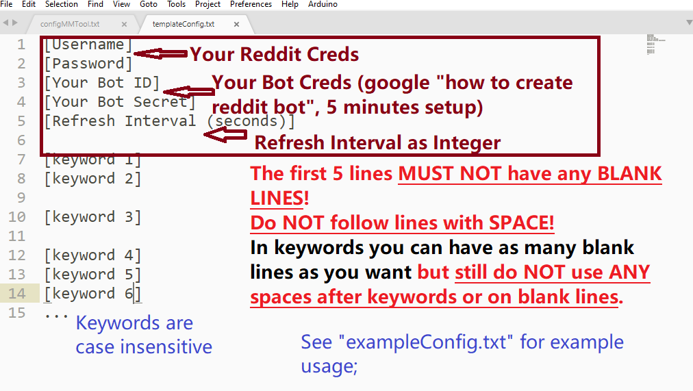
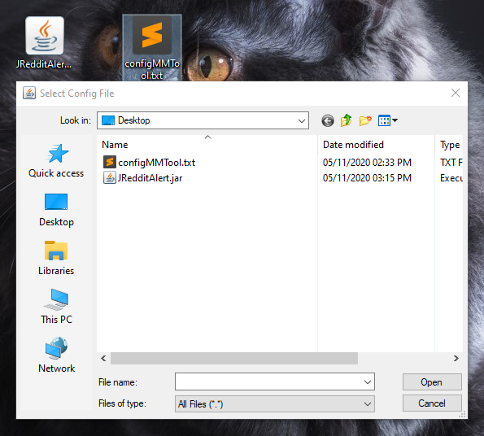
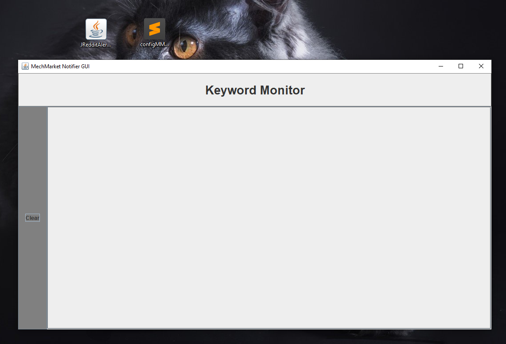
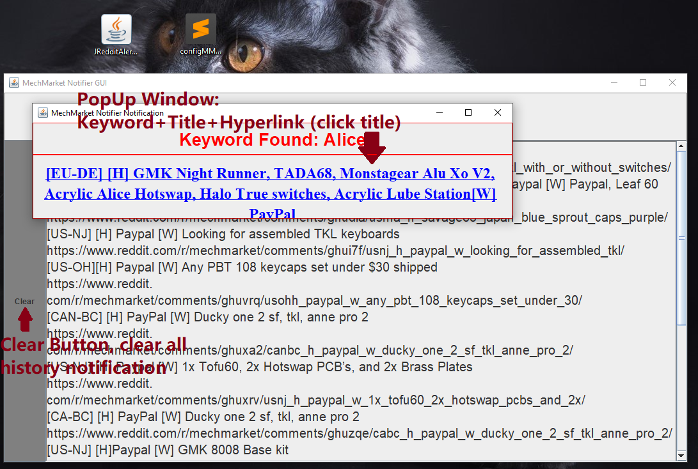

# RMM_NotificationApp
Notification App for r/mm with GUI (+popups) and keyword configurations; 

Based on Java 11 and JRAW; 
Runs from local .jar executable, has GUI and popup notifications, gets data directly from reddit; (no discord, no IFTTT, notifies as soon as the post appears and everything runs from your pc with you in total control);

The executable will check r/mm every given time interval, find if there are any matching keywords under the [H] tag, and popup a notification window with keyword and hyperlink information on your screen; \
Refresh Interval and Keywords are both configurable from the config file;  

<b>Requirements</b>: 
1. Java Environment on Desktop (reasonable recent version, to run .jar as executable properly); 
2. Your Reddit Account & Password; 
3. A empty personal Reddit bot (needed for botID and botSecret, take 5 minutes to register and create on https://www.reddit.com/prefs/apps/); 

<b>Usage</b>: 

<b>Step 1</b>: Download the .jar file: https://github.com/Roger-ZRZ/RMM_NotificationApp/blob/master/out/artifacts/JRedditAlert_jar/JRedditAlert.jar;

<b>Step 2</b>: Write/modify your config file according to the template or example; (see picture below and both .txt files in this directory) (note that in a recent update, line 6 is dedicated to indicating the Region of the seller, as in "US" or "EU")\

<b>Step 3</b>: Double click on the .jar file you just downloaded, you should expect a file selection window to appear just like in the picture below; choose the config file you just wrote in step 2; \

<b>Step 4</b>: A window like the following will appear and you are done starting the program; this window will show the history (from now on) of all the posts that contains your keyword in their [H] tag; The clear button on the left will clear all history in text area; \

<b>Step 5</b>: Whenever such a post appears, a notification window will pop up on top of all of your currently opened windows (no matter if you have the last window minimized); The blue link is clickable and will send you directly to the post; Note that you should CLOSE the notification window after you finish viewing the notification, so the next notification can popup properly upon another keyword hit; \

<b>Cautions: </b>
1. If you want to change the keywords you will have to change the keywords in the config file and <b>restart</b> the program; 
2. Follow the templates for config file strictly; any wrong config files will result in outright crash, program hanging, or undefined behavior;
3. This program was written for personal use and uses sub-optimal coding practices for the interest of time; not all error are handled and some low performance practices are used but none should interfere with actual usage; the code is very short and you are welcome to clone and modify it to your own need; 

<b>Troubleshooting</b>:
1. If the .jar file won't even run, you have not installed java properly or is using some very old java versions, install or update your java runtime; 
2. If the program crashed right after file selection, you do not have a correct format/bot/login Information; if you do please let me know; error detection may be added in future implementations; 
3. If something looks wrong/is not working/doesn't do what you want/you have suggestions, feel free to message me or leave a Issue in the [Issue] tab on github; 
4. I have not tested this code on MacOS and I do not have a macbook, sorry; 
 